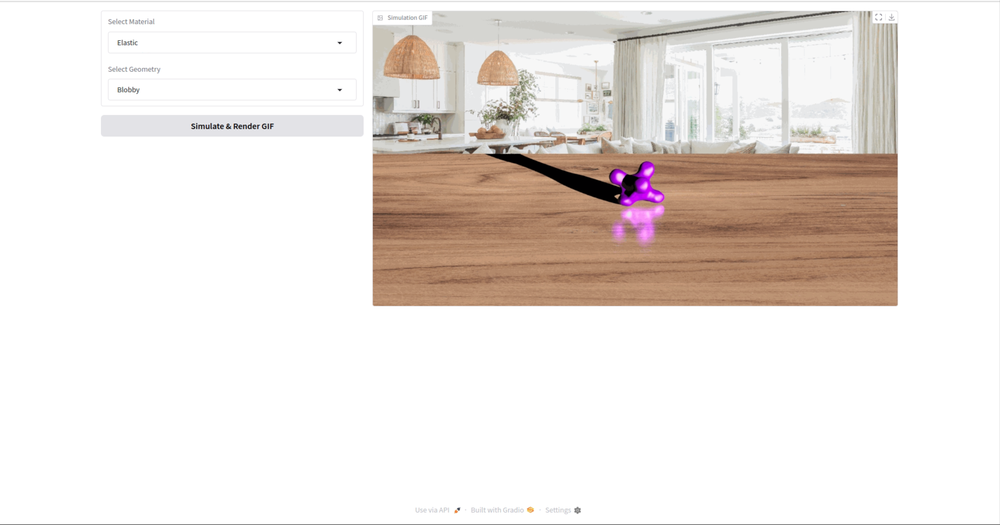

# <p align="center"> UniPhy: Learning a Unified Constitutive Model for Inverse Physics Simulation </p>


#####  <p align="center"> [Himangi Mittal](https://himangim.github.io/), [Peiye Zhuang](https://payeah.net/), [Hsin-Ying Lee](https://hsinyinglee.com/), [Shubham Tulsiani](https://shubhtuls.github.io/)</p>
##### <p align="center"> CVPR 2025


#### <p align="center">[Paper]() | [Project Page]() | <a href="https://cmu.app.box.com/folder/285937780047?s=d4lrsn8iwsfgeczr6hpjm7ng5ifkcjah">Dataset</a> 

# <p align="center">  </p>

## Prerequisites

This codebase is tested using the environment with the following key packages:

- Ubuntu 20.04
- CUDA 11.7
- GCC 9.4.0
- Python 3.10.14
- PyTorch 1.13.1
- Warp 0.6.1

## Installation

Setup conda environment:

```bash
conda create -n uniphy python=3.10
conda activate uniphy
```

Install required packages:

```bash
conda create -n uniphy python=3.10
conda activate uniphy
pip install torch==1.13.1+cu117 torchvision==0.14.1+cu117 torchaudio==0.13.1 --extra-index-url https://download.pytorch.org/whl/cu117
pip install numpy==1.26.4 scipy==1.12.0 pyvista==0.43.4 hydra-core==1.3.2 trimesh==4.2.0 einops==0.7.0 tqdm==4.66.2 psutil==5.9.8 tensorboard==2.16.2 ipython open3d==0.18.0 scikit-image==0.22.0 gradio
pip install taichi==1.7.0
bash ./build.sh
pip install warp-lang==0.6.1
```

Compile `warp`:

```bash
bash ./build.sh
```

## Run Demo

Download the model weights and gradio demo data from [Google Drive Link](https://drive.google.com/drive/folders/1C0FSG7DQ4b9qmu28Hw0ShyTK3PZhBMln?usp=drive_link). 
Place the model weights in root_folder/ckpt folder and the gradio demo data in the root_folder/gradio_demo/gradio_demo_data folder.

Run the demo to simulate material latent:
```bash
python gradio_demo/gradio_demo.py
```

Run the demo to infer material latent:
```bash
python gradio_demo/gradio_demo_infer_material.py
```



In the demo, you can select the material, geometry, and then render the visualization of the simulation which uses the material latent.

## Training

First, download the dataset or create a dataset for training.

### Dataset
The dataset consists of five different classes of materials: elastic, plasticine, Newtonian fluids, non-Newtonian fluids, and sand. 
Our dataset includes objects with various geometries, with motion in different directions and having a diverse range of material physical parameters. 
The dataset can be downloaded from the [Google Drive Link](https://drive.google.com/drive/folders/1C0FSG7DQ4b9qmu28Hw0ShyTK3PZhBMln?usp=drive_link). 

To generate the dataset, run the following command.

```bash
cd data_process
python dataset_generate_all_materials.py
```

For training:

```bash
python train_latent_space.py
python experiments/scripts/train/train_latent_optimization.py
```

For evaluation:

```bash
python experiments/scripts/eval/reconstruction.py --gt
```

# Citation

If you use any parts of our work, please cite the following:

```

```